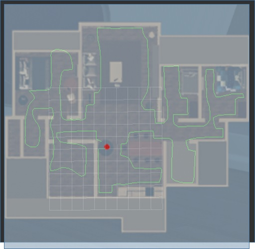
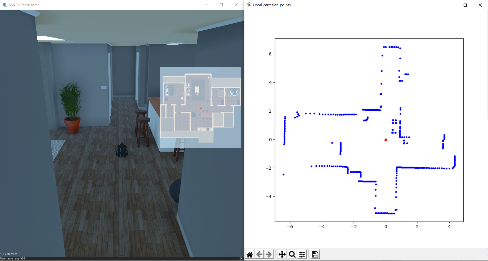
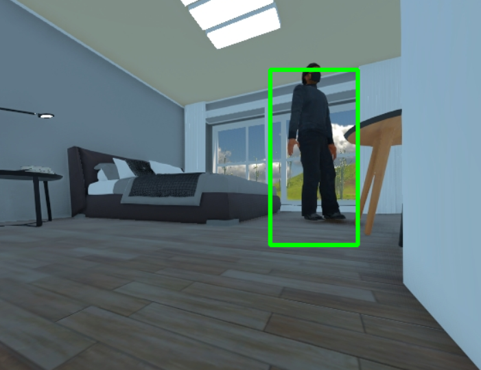
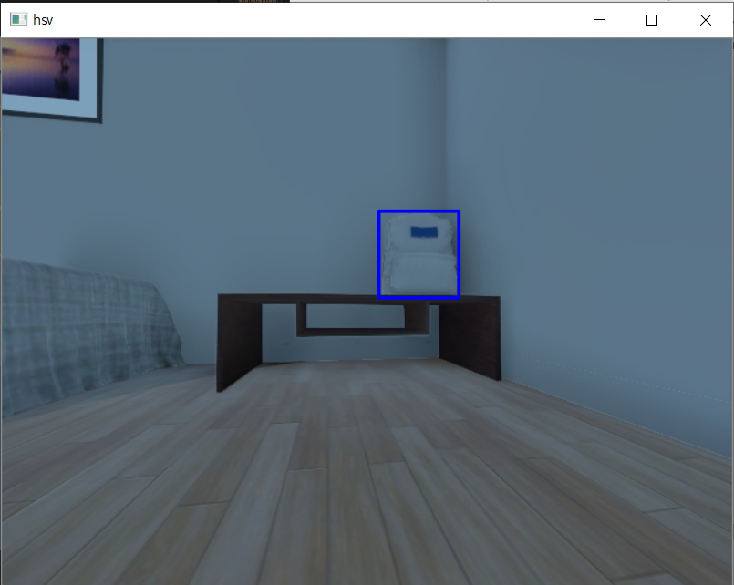
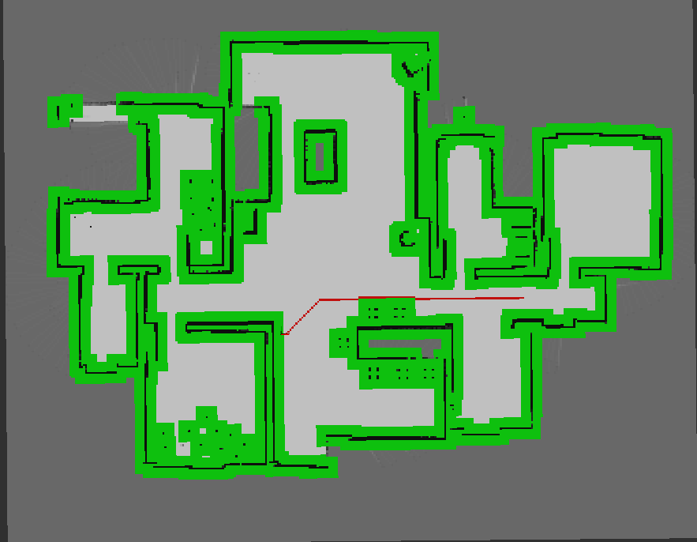

<h1 align="center">SSAFY 2학기 특화 PJT 🤖</h1>

 

- SSAFY 3기 2학기 서울 2반 7팀 IoT제어

- 2020.08.31 ~ 2020.10.09 (약 7주)

- Notion [바로가기](https://www.notion.so/SSAFY-2-PJT-88cccf0c5ec64822ab4be1f5f9afc67b)

- Front-end : [Mock-up](https://ovenapp.io/view/mA68SiZmDPsl9VarKd1DZmLpHDBzIWrt)

 

## Members

🔴 **곽은정** (@iamkkwak) | 🟠 **박지호** (@wlgh325) | 🟡 **원주연** (@wndus9382)

🟢 **이희진** (@university1809) | 🔵 **장하람** (@jkwkdz1) | 🟣 **차보람** (@ckqhfka4520)

 

## Docs

#### 📝 [회의록](https://lab.ssafy.com/s03-iot-sub2/s03p22a207/tree/master/docs/notes) | 📚 [스터디](https://lab.ssafy.com/s03-iot-sub2/s03p22a207/tree/master/docs/study) | 💡 [꿀팁](https://lab.ssafy.com/s03-iot-sub2/s03p22a207/tree/master/docs/tips)

 

## Project

- SUB1 : ROS2 통신 프로토콜 이해 및 활용 -  [📖](docs/project/sub1.md)

- SUB2 : 인지, 판단 및 제어 - 진행중

 

### # 1. 판단/제어 프로젝트

#### 1-1 주행기록계

- 로봇의 상태 메시지(선속도, 각속도) 받아서 주행기록 계산하기
- 선속도, IMU의 Quaternion을 이용해 주행기록 계산하기

#### 1-2 경로 기록 및 읽어오기

- 주행기록 기반 경로 저장하기
- 경로 Publish 하기
- 저장한 경로 읽어와 Publish 하기
- 다양한 경로 생성

#### 1-3 경로 추종

- 로봇의 현재 위치, 경로로 메시지 Subscribe
- 선속도, 각속도 계산
- 제어 메시지 Publish

### # 2. 인지 프로젝트
#### 2-1 Point Cloud 좌표 변환

- 시뮬레이터의 LaserScan 메시지 받기
- Range/Angle로 이루어진 Point를 x, y 2차원으로 변환

#### 2-2 Extrinsic Calibration

- Utils.py 내 Lidar2Camera Transfromation matrix 구현
- Utils.py 내 project2cam()의 instrinsic matrix 구현
- 카메라 시야 밖의 모든 2D 라이다 포인트 제거
- 카메라 이미지에 라이다 포인트 그리기

#### 2-3 침입자 인지

- BGR 이미지 Grayscale 채널 변환
- 보행자 검출을 위한 HoG Descriptor 정의
- 보행자 검출을 위한 SVM Detector 파라미터 불러오기
- 파편화된 보행자 bounding box 통합
- 입력 이미지 위에 보행자 검출 결과인 bounding box 그리기

#### 2-4 소지품 인지

- Semantic segmentation image 데이터 파싱
- 지갑, 키, 백팩, 리모콘 이진화
- 각 소지품의 bounding box 계산
- 입력 이미지 위에 보행자 검출 결과인 bounding box 그리기

 

### # 3. 맵 기반 경로생성
#### 3-1 A*를 활용한 전역경로 생성

- 맵 데이터를 읽어오기
- 로봇의 절대 위치, 헤딩 정보를 수신하기
- 로봇의 위치 (x, y)를 grid map의 cell로 매핑
- A* 알고리즘으로 최단 경로 탐색
- grid map의 cell을 위치 (x, y)로 매핑
- 경로 데이터 publish 하기

