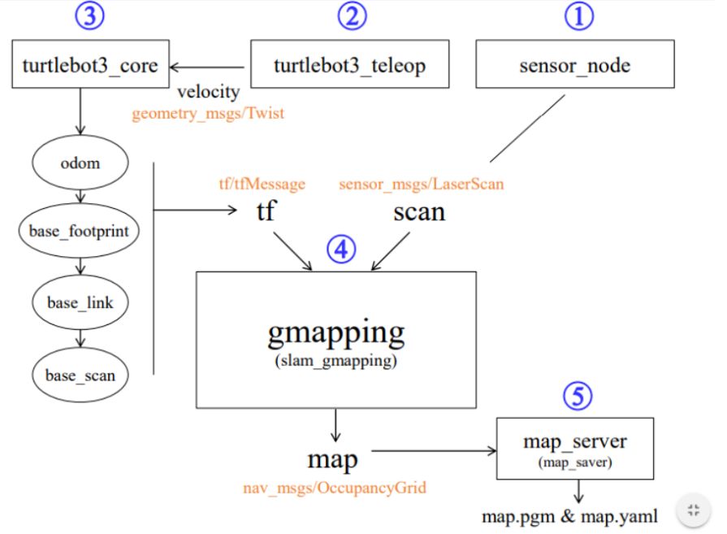

# Gmapping

### **SLAM**

- Simultaneous Localization and Mapping
- 지도를 만들면서 동시에 자신의 위치를 인식하는 기술

### **기본**

- ROS의 기본 패키지이다.
- **특징**
    - 파티클 필터를 사용하며 그리드 맵을 제공한다.
        - [파티클 필터](https://ko.wikipedia.org/wiki/%ED%8C%8C%ED%8B%B0%ED%81%B4_%ED%95%84%ED%84%B0)
        - 그리드 맵
            - 자료가 격자 형태로 전달되어지는 지도를 말한다.
            - 일정한 크기의 공간을 Cell단위로 나누어 표현
            - 각 Cell의 데이터는 Ocuupied space, Free space로 구분됨
    - **Rao-Blackwellized Particle Filters** 방법론을 사용한다?
    - 센서를 이용해 맵을 생성하기 때문에 다음과 같은 환경에 적합하지 않다.
        - 장애물이 없는 정사각형태 환경, 평행한 복도
        - 유리창, 거울, 물가(레이저, 적외선이 제대로 동작 x)
- 사용하기 위해 하드웨어적으로 필요한 것
    - X, Y, 각 속도 이동 명령
    - 주행기록계(odomatry)
    - 2차 평면 계측 가능 센서
    - 직사각형 및 원형의 로봇(길쭉한 형태등은 안됨)

### **처리 과정**

- 1번 : 로봇의 센서데이터를 불러오는 노드
- 2번 : 로봇을 원격으로 조작하기 위한 노드
- 3번 : 터틀봇의 코어, 주행기록계와 바퀴위에 레이저의 위치를 가지고 있다.
- 필요한 토픽
    - 지금까지 주행해온 기록계 연결된 레이저의 위치와? 그 레이저의 센서 데이터 값.
- 즉, 본인 위치를 알고 자기로 부터 얼마나 물체가 떨어져 있는지 안다면 나머지는 스택으로 쌓으면 맵을 만들 수 있음.
- (주행기록의 문제는 칼만 필터, 파티클 필터 등으로 해결한다.)

### Gmapping vs Cartographer

[https://youtu.be/lkW4-dG2BCY](https://youtu.be/lkW4-dG2BCY)

### ROS2, Window환경에서 사용가능한지 모르겟음.

### **추가 자료**

- [**Gmapping Wiki**](http://wiki.ros.org/gmapping)