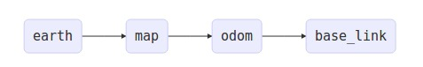

# Odometry (오도메트리)

### 오도메트리(Odometry)란?

- odometer : 자동차 계기판에 표시되는 '주행거리' → 차량의 바퀴 회전수를 체크(엔코더와 같은 방식)해서 차량의 진행 거리를 측정
- Robotics에서의 odometry에서는 단순한 이동거리가 아니라 로봇이 움직인 전체 경로를 표현하기도 함
- 로봇의 위치 및 방향을 인식하는 방법을 뜻함.
- 사용하는 센서에 따라서 3가지 방식으로 구분됨.
    1. Wheel Odometry : 엔코더 사용
    2. Visual Odometry : 카메라 사용
    3. Visual Inertial Odometry : 카메라 + IMU 사용
- 일반적으로 관성센서(IMU) 오드메트리(Odometry)를 이용하고, 현대의 이동 로봇은 실시간으로 이동 로봇의 위치를 추정함과 동시에 지도를 작성하는 SLAM(Simultaneous Localization And Mapping) 기술을 많이 사용하고 있음.

### IMU

- Inertial Measurement Unit
- 관성센서 : 관성력을 측정하는 센서
- ROS message type : [sensor_msgs/Imu](http://docs.ros.org/api/sensor_msgs/html/msg/Imu.html)
- 출력 데이터

    [자이로스코프]

    1. `angular_velocity` : 세 개의 물리축 (x, y, z) 각각을 중심으로 한 회전 속도. 
    2. `angular_velocity_covariance` : 자이로 스코프의 보정되지 않은 각속도의 측정 노이즈.  3x3 공분산 행렬로 제공됨.

    [가속도계]

    1. `linear_acceleration` : 중력을 포함하여 세 개의 물리축 (x, y, z) 모두에 적용된 가속력.
    2. `linear_acceleration_covariance` : 가속도계의 보정되지 않은 선형 가속도의 측정 노이즈.  3x3 공분산 행렬로 제공됨.

### Odom Frame



- odom frame을 설계함에 있어 일반적으로 위와 같은 구조로 frame을 설계함
- map은 여러 개의 odom을 가질 수 있으나 odom은 단 하나의 map을 가질 수 있음. → 1개의 map위에 다수의 로봇이 존재하면 odom은 로봇의 개수 만큼 존재함
- **earth**

    -earth frame은 여러 대의 로봇들이 서로 다른 map 위에서 존재할 수 있도록 함. 로봇들이 한 빌딩의 각 층에 위치하여 서로 다른 map을 가지고 있을 경우 earth frame은 모든 map frame을 통해 각 층의 정보를 가질 수 있음

- **map**

    -map frame은 world fixed frame으로서 earth frame에 고정된 프레임. odom frame이 움직일 때 drift가 발생하여 로봇의 위치가 미세하게 바뀌는 경우가 발생하는데, map frame은 연속적이지 않기 때문에 시뮬레이션을 돌릴 때 마치 로봇이 갑자기 순간 이동한 듯 움직이는 경우를 볼 수 있음. 

- **odom**

    -odom frame은 world fixed frame으로서 또한 earth frame에 고정된 프레임. odom frame은 로봇의 위치를 연속적으로 나타낼 수 있어 로봇이 갑자기 순간이동을 하는듯한 모습을 보이지 않고 부드럽게 움직일 수 있도록 함. 

- **base_link**

    -base_link frame은 로봇 자체의 위치를 나타내는 frame. base_link frame의 위치를 odom 혹은 map frame을 사용하여 위치를 추정하는 방법으로 로봇의 위치를 파악할 수 있음.

[https://elecs.tistory.com/296](https://elecs.tistory.com/296)

### [참고] ROS tf(transform) package

[TF (transform) in ROS.pdf](../files/TF(transform)_in_ROS.pdf)

- ROS Message type : [http://docs.ros.org/melodic/api/geometry_msgs/html/msg/TransformStamped.html](http://docs.ros.org/melodic/api/geometry_msgs/html/msg/TransformStamped.html)
- 여러 좌표 프레임간의 관계를 유지하기 위해 사용함.
- 부모 프레임과 자식 프레임을 정의 → 두 개의 서로 다른 좌표 프레임의 관계를 나타내고 서로 변환할 수 있어야 함
- forward transform : 부모 프레임 → 자식 프레임
- inverse transform : 자식 프레임 → 부모 프레임

```python
self.base_link_transform=geometry_msgs.msg.TransformStamped()
self.base_link_transform.header.frame_id = "odom"  # 부모 프레임
self.base_link_transform.child_frame_id = "base_link"  # 자식 프레임
```

### 참고 사이트

[Wiki](http://wiki.ros.org/navigation/Tutorials/RobotSetup/Odom)

[관성센서(IMU, Inertia Measurement Unit) 란?](https://m.blog.naver.com/PostView.nhn?blogId=ghgus2020&logNo=220249094955&proxyReferer=https:%2F%2Fwww.google.com%2F)

[WO2017091008A1 - 이동 로봇 및 그 제어 방법 - Google Patents](https://patents.google.com/patent/WO2017091008A1/ko)

[Concept of Localization/VO/VSLAM for Autonomous Driving](http://blog.naver.com/PostView.nhn?blogId=mesa_&logNo=221469553957&parentCategoryNo=11&categoryNo=&viewDate=&isShowPopularPosts=true&from=search)