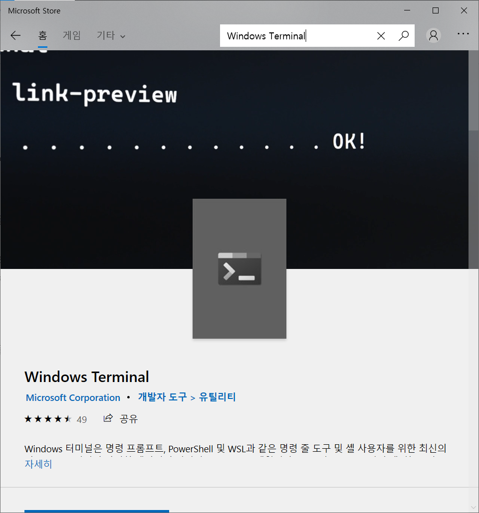
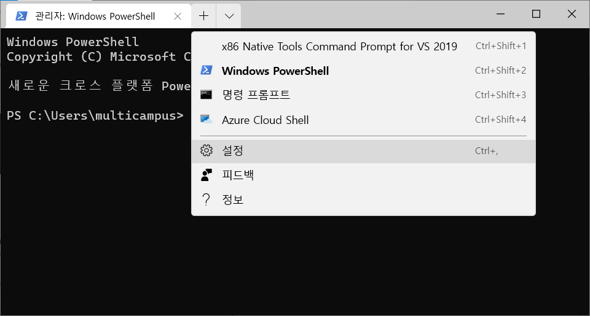
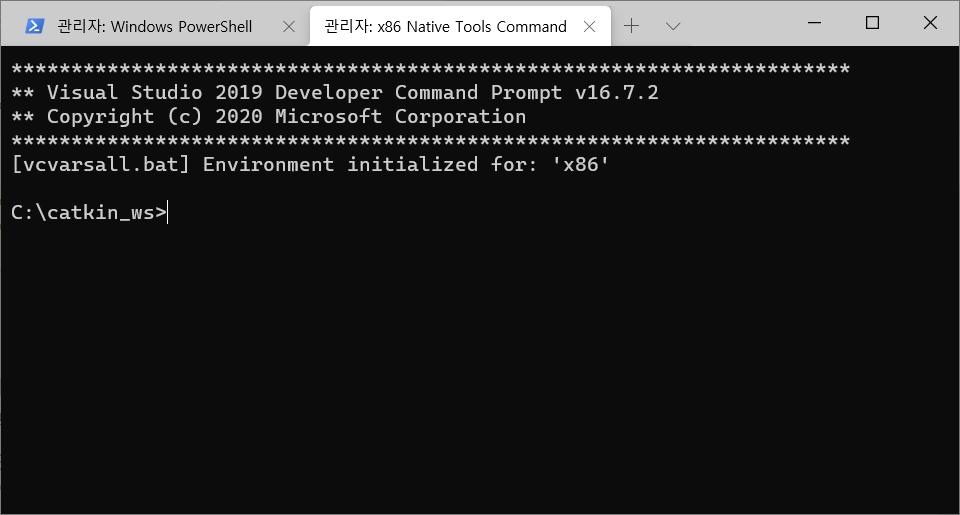

# Windows Terminal 설정하기

명세서에 잠깐 Windows Terminal을 설치하라는 말이 나왔던거 기억하시나요..?

그 뒤에 뭐 어떻게 하라는 말이 없어서 까먹고 있다가...

프로젝트 진행하면서 하도 탭을 이리저리 켰다 껐다 하다보니 좀 짜증나서 ㅋㅋㅋㅋㅋ

혹시나 해서 사용해봤더니 우분투의 터미널처럼 사용할 수 있는 기능을 제공하네요!

이미 쓰고 계신 분이 있을 수도 있지만 혹시 몰라서 공유합니다. (저만 안 쓰고 있던 건 아니겠죠..?)

<br>

### #1.

시작 메뉴에서 Microsoft Store로 들어가주세요. Windows Terminal을 검색해서 아래 앱을 설치해주세요.



> 혹시 설치가 안된다면 Windows를 업그레이드 해야합니다. (제가 그랬습니다..)

<br>

### #2.

설치한 Windows Terminal을 열고 설정으로 들어갑니다.

(저는 이미 VS Native Tools을 설정한 상태라 목록에 뜨는데 실제로는 없음!)



<br>

### #3.

뜬금없이 비주얼 스튜디오 2019 어쩌고 뜨는데 로그인 하라하면 해주고.. 여튼 VS 2019가 실행되고 `setting.json`창이 뜹니다.

`profiles` 항목이 보일텐데요, 그 아래 `list`에 파워쉘이랑 cmd 창이랑 기본적으로 있는 것도 보이시죠? 거기에 native tool을 넣어줍니다.

```json
"profiles": {
    "defaults": {
      // Put settings here that you want to apply to all profiles.
    },
    "list": [
      {
        "guid": "{00000000-0000-0000-0000-000000000000}",
        "name": "x86 Native Tools Command Prompt for VS 2019",
        "commandline": "%comspec% /k \"C:\\Program Files (x86)\\Microsoft Visual Studio\\2019\\Community\\VC\\Auxiliary\\Build\\vcvars32.bat\" && call C:\\dev\\ros2-eloquent\\setup.bat && call C:\\catkin_ws\\install\\local_setup.bat",
        "hidden": false,
        "startingDirectory": "C:\\catkin_ws"
      },
// ... 이하 생략
```

guid는 고유하기만하고 아무거나 넣어도 상관없어서.. ㅎㅎ

`commandline`은 해당 터미널을 열었을 때 실행할 명령어입니다. native tool을 실행시키는 명령어와 매번 치기 귀찮았던 `setup.bat` 파일을 자동으로 불러오도록 합니다. 본인의 `setup.bat` 파일 경로에 따라 수정해주세요.

경우에 따라서 `catkin_ws\\install\\local_setup.bat` 처럼 && 이나 ;로 뒤에 추가하시면 될 것 같습니다.

`startingDirectory`는 말그대로 터미널의 시작 경로를 설정합니다. 명세서에 바탕화면에 하랬는데 전 말 안 듣고 C:\에 했습니다 ㅎㅎ; 마찬가지로 본인의 `catkin_ws`에 따라서 경로는 수정해주세요~

<br>

### #4.

설정한 터미널을 열면 native tools 환경에서 `.bat` 파일이 실행되며, `catkin_ws`의 경로로 이동합니다.

해당 터미널을 list 배열의 첫번째에 두었기 때문에 `ctrl+shift+1`을 누르면 설정이 완료된 새로운 창이 바로 생깁니다! (야호)

이제 편리함을 만끽하면 됩니다~~ 🎉



<br>

### +

터미널 창을 추가했을 때 나올 기본 터미널을 설정하는 `defaultProfile` 항목이 있어서 guid로 설정해보려고 했는데 안되더라고요. 1번 단계에서 Preview 버전을 설치하면 된다는 소리도 있긴하던데, 일단 저는 딱히 불편하진 않아서 패스했습니다! 혹시 설정이 되시면 말씀해주세요.. ㅠ_ㅠ

<br>

### Reference

[https://docs.microsoft.com/ko-kr/windows/terminal/](https://docs.microsoft.com/ko-kr/windows/terminal/)

[https://docs.microsoft.com/ko-kr/cpp/build/building-on-the-command-line?view=vs-2019#create-your-own-command-prompt-shortcut](https://docs.microsoft.com/ko-kr/cpp/build/building-on-the-command-line?view=vs-2019#create-your-own-command-prompt-shortcut)