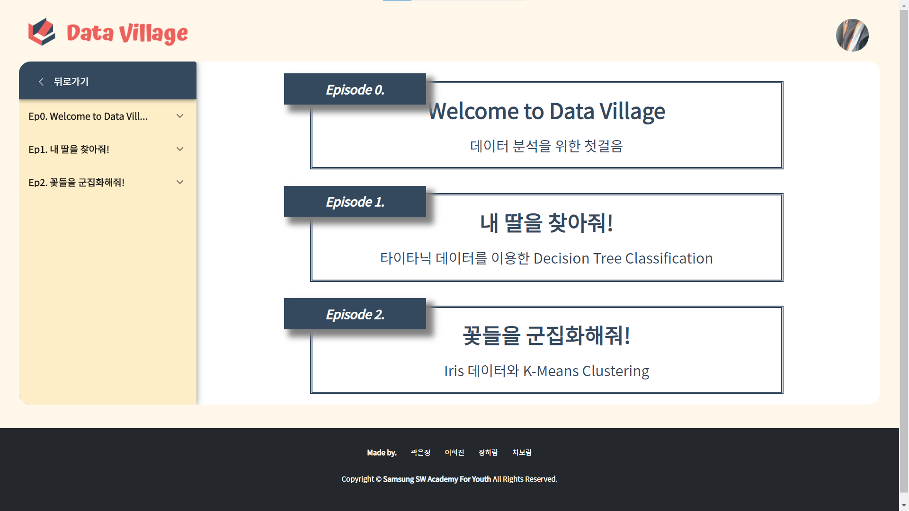

# SSAFY 자율 PJT
- **기간?** 2020.10.12 ~ 2020.11.16 (총 5주)
- **팀원?** 곽은정(팀장) 이희진 장하람 차보람

 

## 📚 데이터 분석 학습 플랫폼 Data Village 📚

- 프로젝트 [계획서](https://drive.google.com/file/d/1-KXczwjPyU_HeAz7vEgke7sqfxKbouQH/view?usp=sharing) & [기능 명세서](notes/specification.md)
- Front-end : [Mock-up](https://ovenapp.io/view/8yAl1r5wdG9AwgjNAF2MvlWXugLPJyD6/)
- Back-end : [ERD](https://www.erdcloud.com/d/SKtabqkqXqh3WERgT)
- [Git commit 메시지 및 merge request 규칙](notes/base-rule.md)

 

### 👉 http://k3a309.p.ssafy.io

## 화면구성

### 메인화면

#### 로그인 전

#### 로그인 후

### 튜토리얼

#### 메인화면

#### 클리어한 챕터와 클리어하지 않은 챕터 표시(사이드바)

#### 에피소드 화면

#### 스텝화면

#### 스텝화면(사이드바 토글)

#### 정답확인(오답)

#### 정답확인(정답)

#### 결과화면

#### 챕터 클리어

#### 챕터의 마지막 스텝인 경우

### Analysis

#### Data 업로드

#### 모델 선택

#### Parameter설정(Decision Tree)

#### Parameter설정(K-Means)

#### Model 다운로드

#### Form Predict

#### File Predict

#### 마이페이지에 Model 저장

#### 마이페이지

#### 설정화면보다 브라우저 크기가 작은경우 나오는 화면

#### 404 페이지

